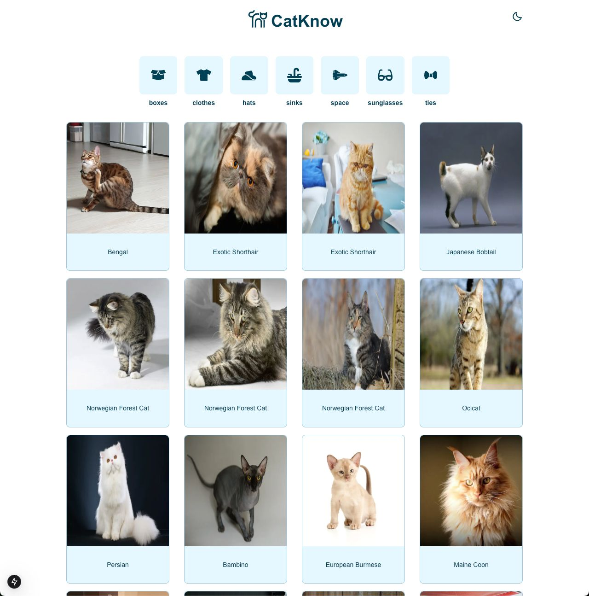
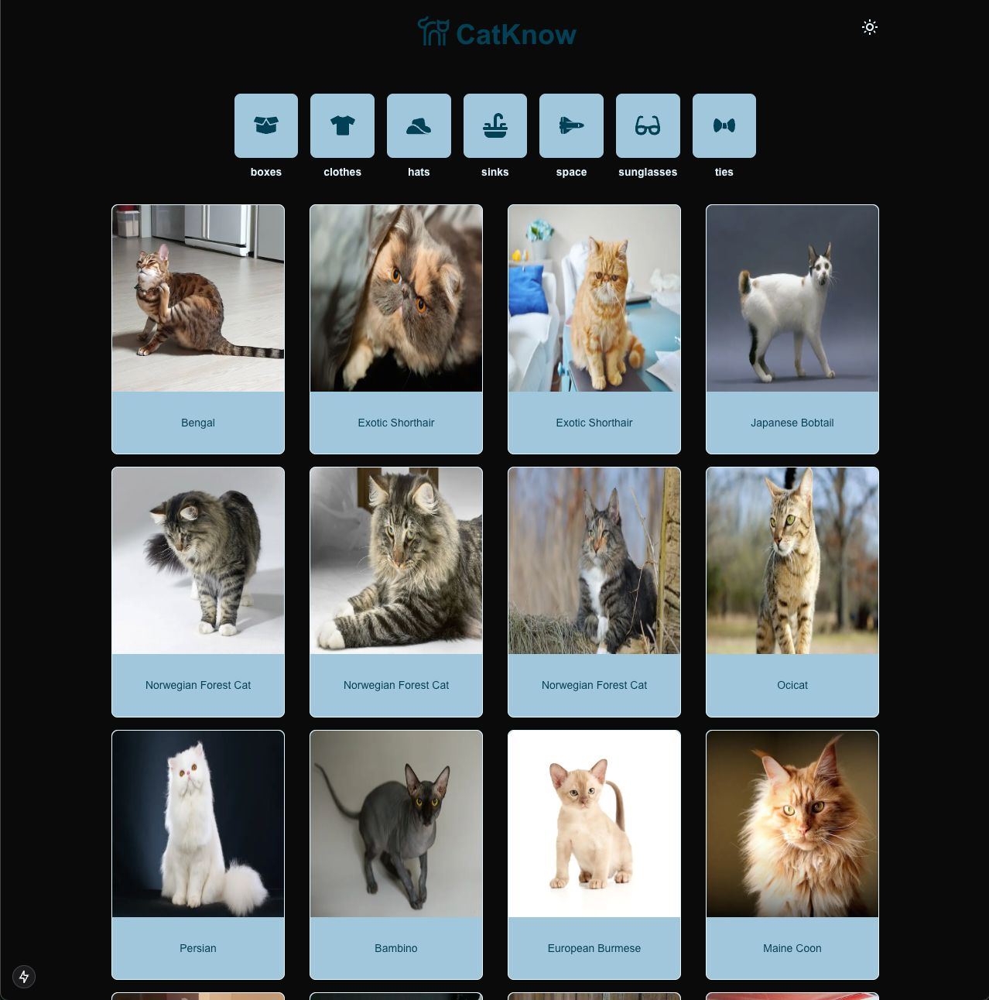
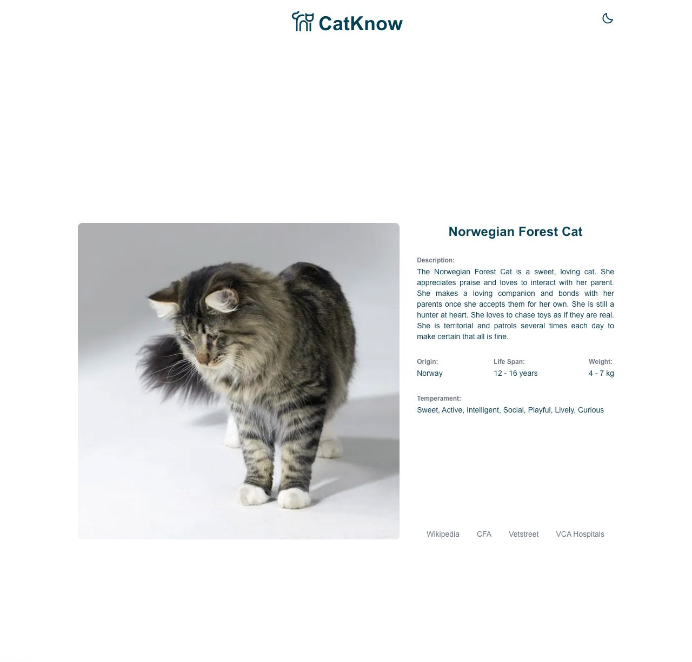
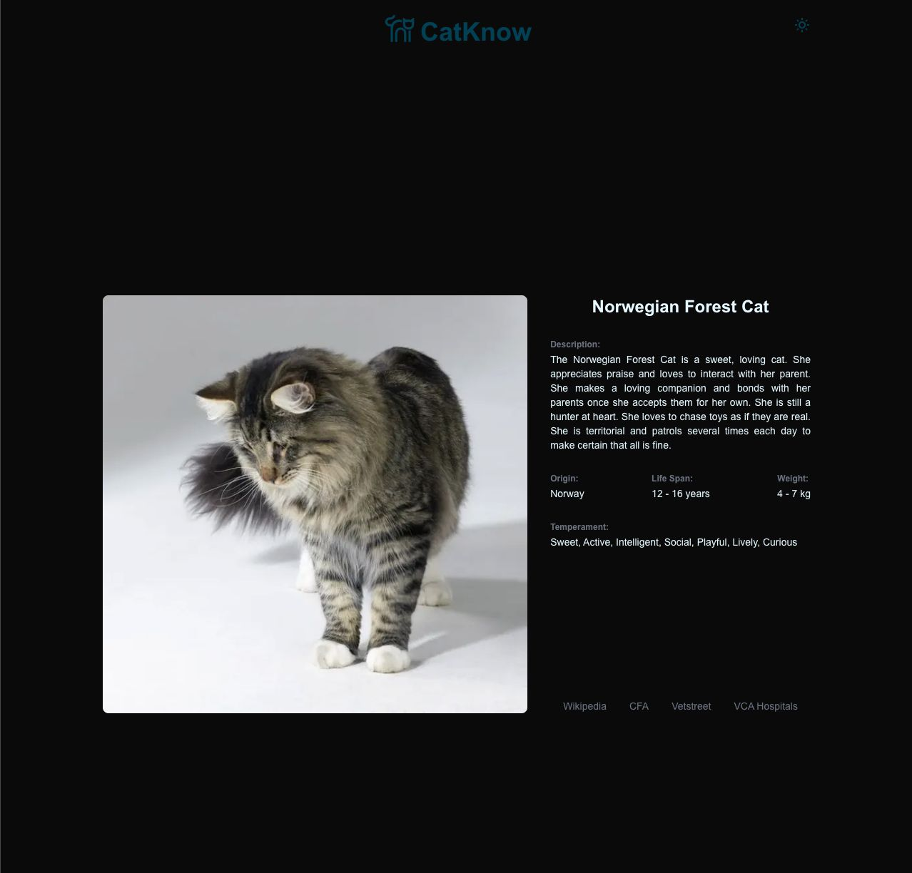

# 🐱 CatKnow

A delightful Next.js application that showcases various cat breeds and their characteristics, featuring a modern, responsive design with dark mode support.

## Overview

CatKnow is an interactive web application that allows users to explore different cat breeds, their characteristics, and detailed information. Built with Next.js and styled with Tailwind CSS, it offers a seamless user experience with infinite scrolling, category filtering, and detailed breed information pages.

## ✨ Features

- **Breed Explorer**: Browse through various cat breeds with infinite scroll functionality
- **Category Filtering**: Filter cats by categories like boxes, clothes, hats, and more
- **Dark Mode**: Toggle between light and dark themes for comfortable viewing
- **Detailed Information**: Access comprehensive breed details including:
  - Origin and life span
  - Physical characteristics
  - Temperament
  - External resources (Wikipedia, CFA, etc.)
- **Responsive Design**: Optimized for all device sizes
- **Image Optimization**: Built-in image optimization using Next.js Image component

## 🖼️ Screenshots







## 🛠️ Technologies Used

- **Frontend Framework**: Next.js 15.0
- **Styling**: Tailwind CSS
- **Language**: TypeScript
- **Icons**: React Icons
- **State Management**: React Context API
- **Fonts**: Geist Sans & Geist Mono
- **Intersection Observer**: For infinite scrolling

## 🚀 Installation

1. Clone the repository:

```bash
git clone [your-repository-url]
```

2. Install dependencies:
```bash
npm install
```

3. Create a `.env` file in the root directory with the following variables:
```bash
API_URL=your_cat_api_url
API_KEY=your_cat_api_key
```

4. Run the development server:
```bash
npm run dev
```

5. Open [http://localhost:3000](http://localhost:3000) in your browser

## 💻 Usage

The application is intuitive to use:

1. Browse cats on the main page
2. Click category icons to filter cats by category
3. Click on any cat card to view detailed information
4. Toggle dark mode using the sun/moon icon


## 📝 Code Structure

The project follows a clean architecture:

- `/src/app`: Page components and routing
- `/src/components`: Reusable UI components
- `/src/actions`: Server actions for API calls
- `/src/providers`: Context providers
- `/src/types`: TypeScript type definitions

---

Built with ❤️ using Next.js and The Cat API
